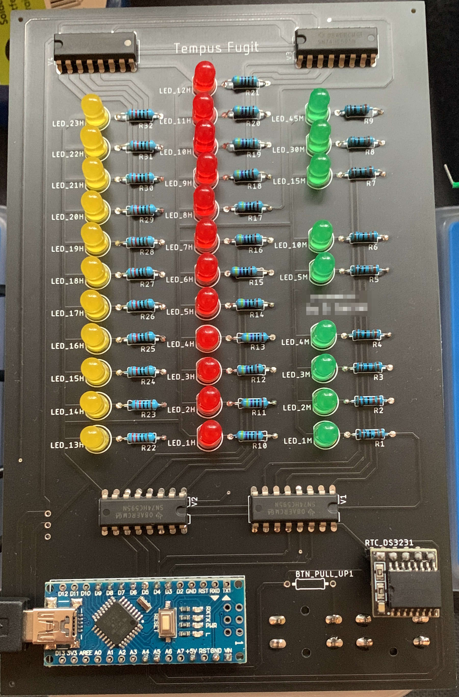

# LED Clock

This is the pcb and software for a clock showing the time as three vertical led bars. 

The hours are split in two bars, 13h to 23h and 1h-12h, while minutes are split in three groups of 15, 5 and single minutes. Summed up you can read the time.

Time is kept with an RTC-DS3231.
Because the outputs of the arduino uno are not sufficient, shift registers are used to output the time.

Result:

## Questions

Please contact me via github if you have any questions or want to rebuild this clock 😉.
